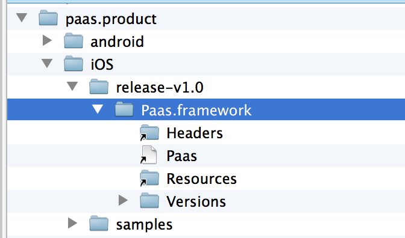
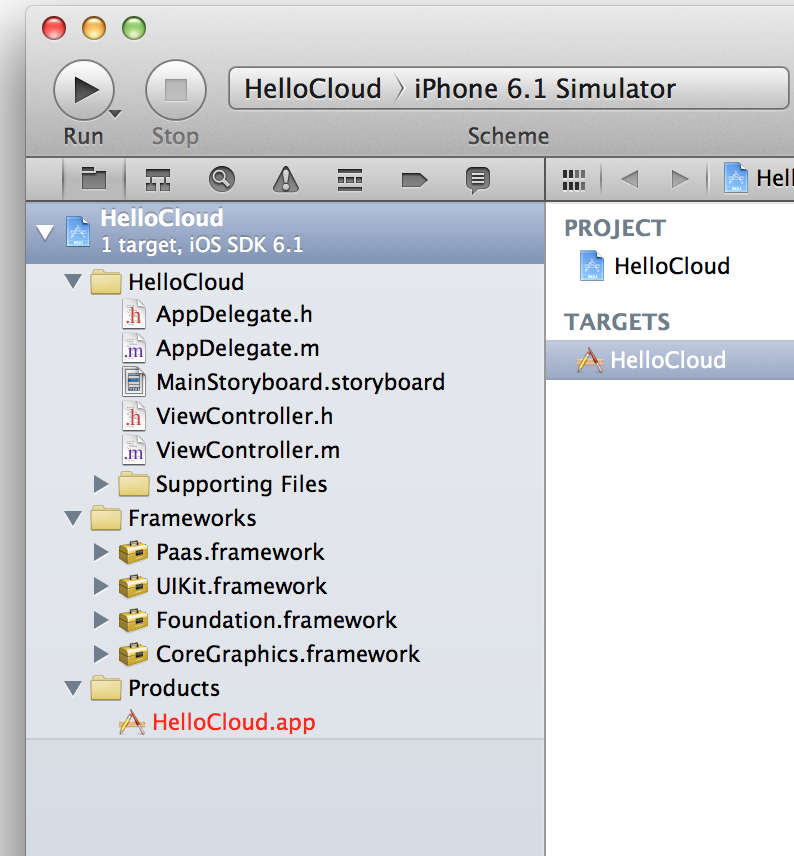

# 申请AVOS Cloud帐号

访问avoscloud.com申请开发人员帐号 


# 创建AVOS Cloud App


# 查看app keys


# 下载SDK

```
git clone git@github.com:avos/paas.product.git
```

# 创建iOS工程


# 将AVOS Cloud SDK加入到工程中




# 引用AVOS Cloud头文件 


# 初始化AVOS Cloud Keys


